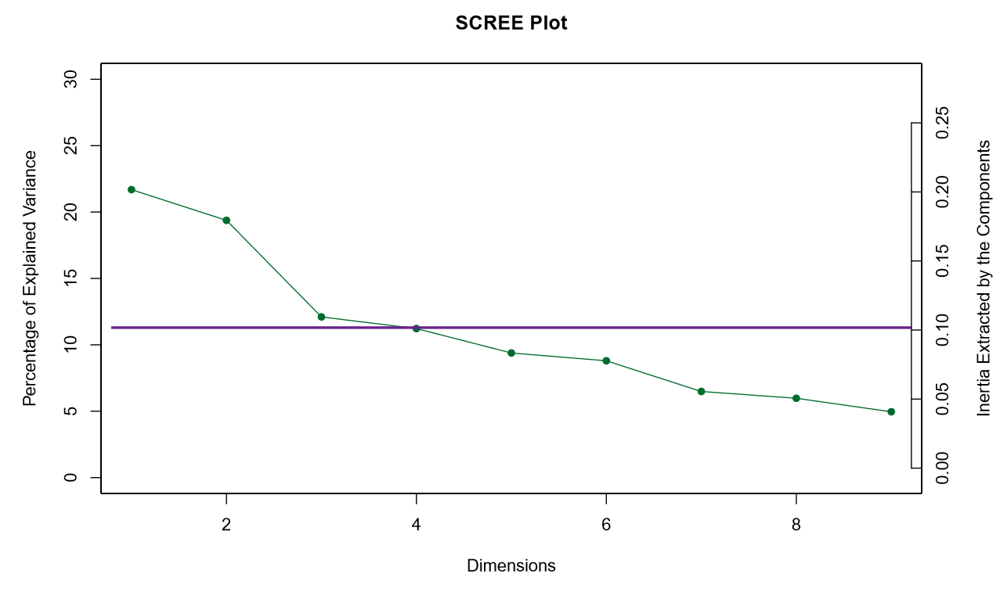

# Twitter Multi Variate Analysis

## Information about Data
Twitter feeds for 3 different streams, Ethereum, Bitcoin, Facebook for March and April 2018

## Research Question 

***Does, otherwise uncorrelated twitter channels, tend to discuss on similar topics as a result of world level event?***

## Methods

### Correspondence Analysis
* Contingency table: Count of words (Top 10) / Log of Count of Words (Top 50)
    + Week 9 – 18
    + Week 9, 16, 18
    + Week 13, 14, 17
    + Week 10, 11, 12, 15

## Dataset

## Heatmap
### Top 10

### Top 50

# Correspondence Analysis
## Scree Plot
### For Count of words

### For log of count of words

## Plotting word occurances vs week - *Top 10*

## Plotting word occurances vs weeks - *Top 10*

## Plotting word occurances vs week - *Top 50*

## Plotting word occurances vs weeks - *Top 50*

## Mapping word occurances vs week (Only means of each dataset)
### For Count of words (Top 10)

### For log of count of words

## Dividing weeks into groups
### For Count of words *(Top 10)*
#### Week 9, 16, 18

#### Week 10, 11, 12, 15

#### Week 13, 14, 17

### For log of count of words *(Top 50)*
#### Week 9, 16, 18

#### Week 10, 11, 12 ,15

#### Week 13, 14, 17

